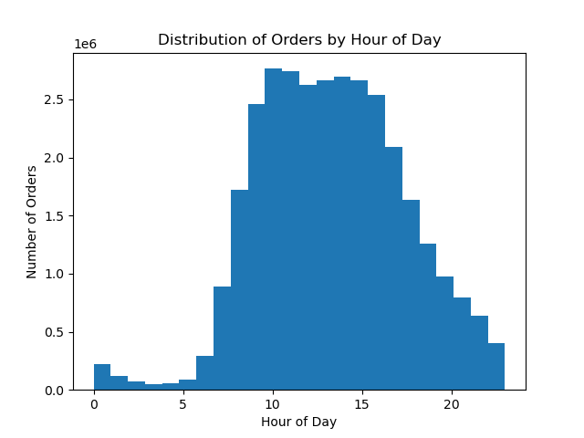

# Instacart Market Basket Analysis

## Project Overview
This project is part of CareerFoundry’s Data Analytics Program (Achievement 4).  
The objective was to analyze Instacart’s grocery shopping dataset to uncover patterns in customer behavior, shopping frequency, and spending habits.  

The analysis highlights customer segmentation, loyalty, and purchasing trends to provide actionable insights for marketing and operations teams.  

## Repository Structure
- **data_prepared/** → Cleaned and wrangled CSV files (not uploaded due to size/privacy).  
- **scripts/** → Jupyter notebooks with step-by-step analysis.  
- **outputs/** → Charts and tables generated during analysis.  
- **reports/** → Final project report with insights and recommendations.  

## Tools & Skills
- Python: pandas, NumPy, matplotlib, seaborn  
- Jupyter Notebook  
- Excel (supporting checks and reporting)  

## Key Steps
1. Data Wrangling & Cleaning  
   - Merged multiple datasets (orders, products, customers).  
   - Checked for missing values, duplicates, and consistency.  

2. Exploratory Data Analysis (EDA)  
   - Investigated spending patterns across demographics and regions.  
   - Segmented customers by loyalty and profiles.  

3. Visualizations & Insights  
   - Created bar charts, distributions, and spending analyses to reveal trends.  

## Selected Visuals

### Customer Profiles by Region
  
Distribution of customer profiles across regions highlights key geographic segments.  

### Spending by Region
  
Average customer spending differs notably across regions, showing marketing opportunities.  

### Orders by Hour
  
Most orders are concentrated in the afternoon and evening, useful for targeted promotions.  

### Loyalty Distribution
  
Identifies customer loyalty categories, key for retention strategies.  

## Final Report
A detailed report summarizing methodology, analysis, and business recommendations can be found here:  

